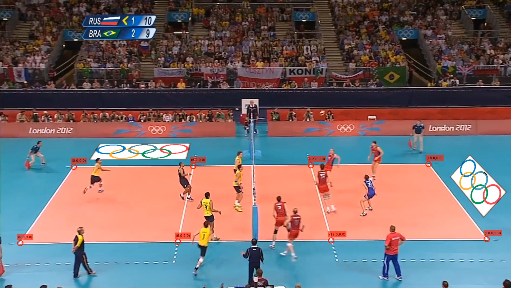

# Virtual Insertion of Ads in Sports Videos

This project aimed to create an automated solution for inserting virtual ads within sports videos. A volleyball match video clip was chosen, and two virtual banners featuring Olympic rings were added. To accomplish this, court lines were detected using morphological tools and the RANSAC algorithm. Then, the intersection coordinates of the court lines were mapped to their respective world frame coordinates. By applying a projective transform, the banners were successfully inserted into each video frame.
